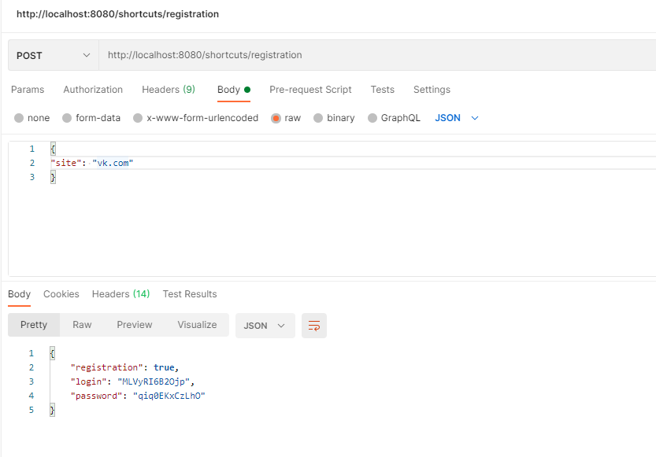
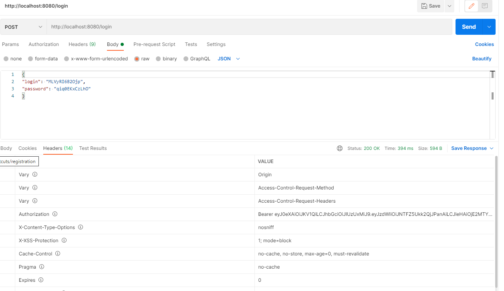
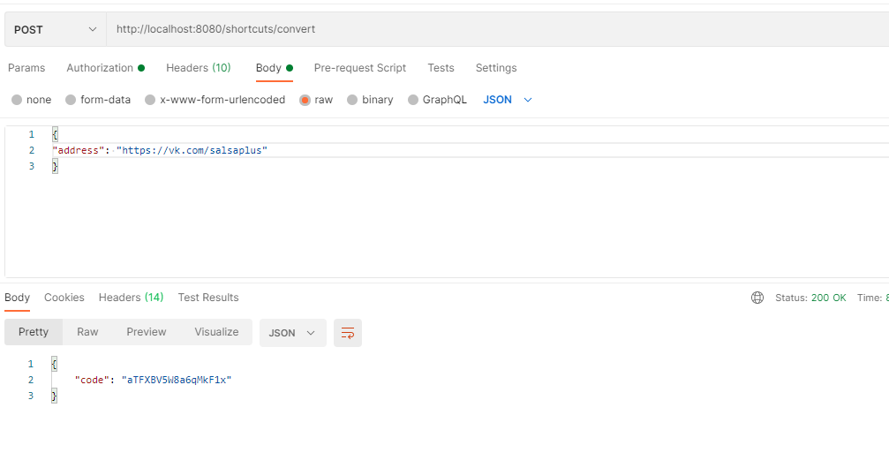
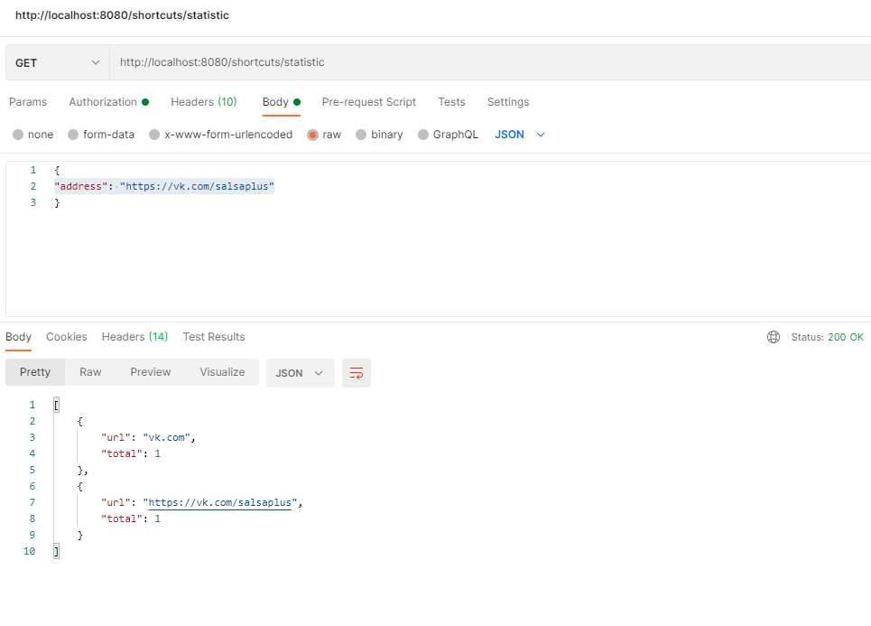

 
Описание проекта 
Проект представляет собой сервис для сбора статистики посещения страниц для различных зарегистрированных в системе сайтов.
Пользователь регистрирует свой сайт и конвертирует ссылки своего сайта при помощи данного сервиса, после чего он может их вставлять где угодно.
Переходя по конвертированной ссылке, пользователь попадает на данный сервис. Далее происходит инкрементация числа посещений данной страницы и последующий редирект на ассоциированную с этой ковентированной ссылкой страницу.
 
В ходе реализации были применены следующие технологии:
Java 14
Spring Boot 2
Spring Security & JWT authorization
Spring Data JPA
PostgreSQL
Liquibase
 

Используем REST API 

Регистрируем сайт 
curl --location --request POST 'http://localhost:8080/shortcuts/registration' \
--header 'Content-Type: application/json' \
--data-raw '{
    "site": "vk.com"
}'
 

Получаем токен 
curl --location --request POST 'http://localhost:8080/login' \
--header 'Accept: application/json' \
--header 'Content-Type: application/json' \
--data-raw '{
    "login": "your_login",
    "password": "your_password"
}' 

 

Конвертируем ссылку 
curl --location --request POST 'http://localhost:8080/shortcuts/convert' \
--header 'Authorization: Bearer your_token\
--header 'Content-Type: application/json' \
--data-raw '{
    "address": "https://vk.com/salsaplus"
}' 

  
   

Получаем статистику 
curl --location --request GET 'http://localhost:8080/shortcuts/statistic' \
--header 'Authorization: Bearer your_token\

  
    

